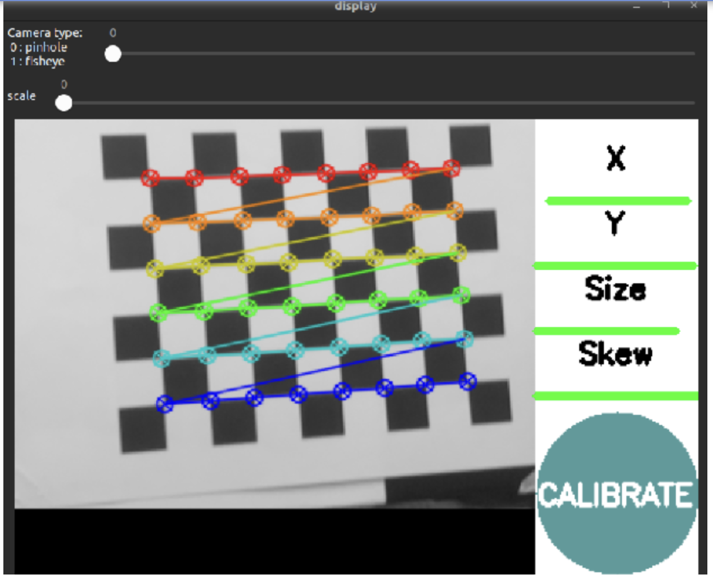
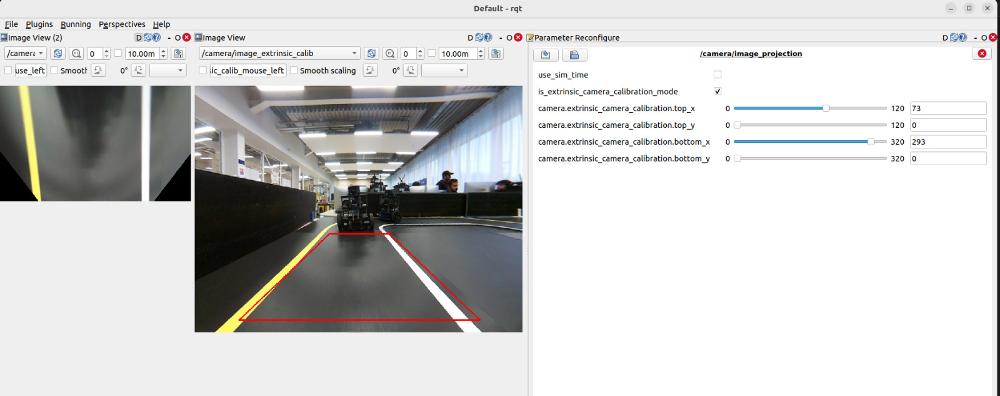
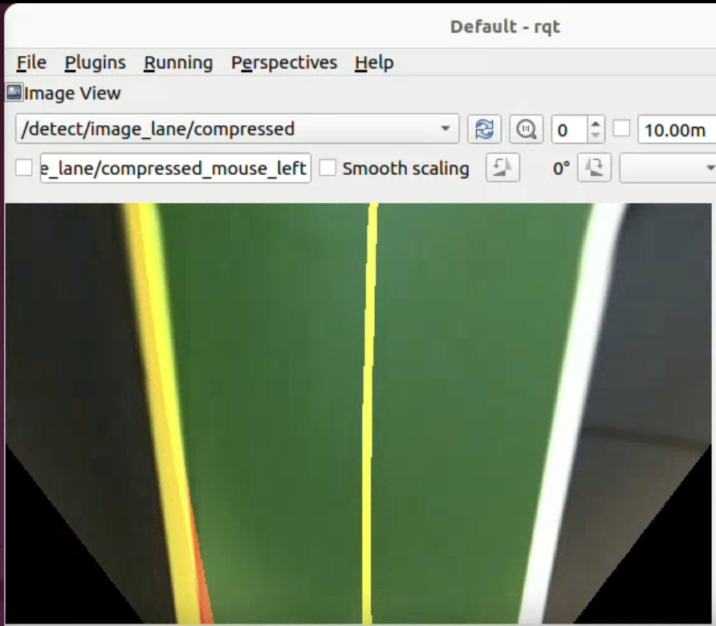
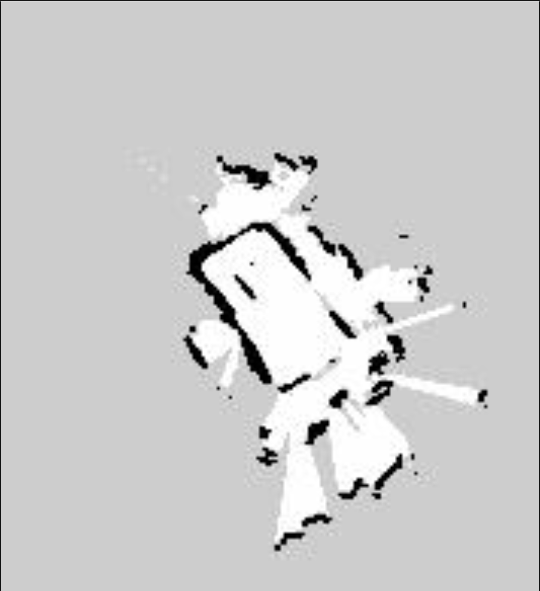
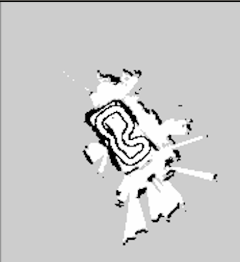
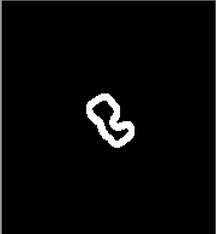

# Ground-Robot-Performing-Tasks-Autonomously-by-Perception

## Group Members

- Syed Sameed Ahmed 
- Qadeem Khan 

## Introduction

This project implements a complete autonomous navigation system for TurtleBot3 that combines autonomous lane-following, simultaneous localization and mapping (SLAM), and path planning with virtual obstacle integration. The system enables the robot to autonomously drive along lanes, build a map of the environment, and navigate using the generated map with lane boundaries marked as virtual obstacles.

The project is divided into four main phases:
1. Camera calibration for accurate image processing
2. Autonomous driving with lane detection and tracking
3. SLAM mapping to create a map of the environment
4. Navigation using the generated map with integrated virtual lane obstacles

## Phase 1. Camera Calibration: 

It the process of estimating the intrinsic and extrinsic parameters of a camera. This procedure is fundamental in computer vision and photogrammetry, as it allows for the precise and accurate measurement of 3D objects and scenes from 2D images. 


Turtlebot3 has Raspberry Pi Camera Module v2 (OV5647 sensor) camera as a vision sensor having iage resolution 800 x 600. I followed the official TurtleBot3 Raspberry Pi camera calibration guide at:
https://emanual.robotis.com/docs/en/platform/turtlebot3/appendix_raspi_cam/

### Calibration Steps

1. Prepared a printed checkerboard (size 7x9 for the calibration procedure). Each square size is 0.010 m.
2. Install the ROS 2 calibration package:

    ```
    sudo apt update
    sudo apt install ros-${ROS_DISTRO}-camera-calibration
    source /opt/ros/${ROS_DISTRO}/setup.bash
    ```


3. Run the camera node on the TurtleBot3 SBC or simulation camera node in simulation.
    ```
    ros2 run camera_ros camera_node --ros-args -p format:='RGB888'
    ```

4. Run the calibration node from the remote PC and pass parameters for checkerboard size and square length:

    ```
    ros2 run camera_calibration cameracalibrator --size 7x9 --square 0.010 image:=/camera/image_raw camera:=/camera
    ```

5. When the checkerboard is detected, move the checker board in x and y direction also forward and backward to estimate size and skew, and calibration completes, save the yaml file in /home/ubuntu/.ros/camera_info/ so that other nodes can use it. 



Follwing are the intrinsic parameters of our calibrated camera:

## Camera Calibration Parameters

This project uses a calibrated pinhole camera model with OpenCV conventions.  
The following parameters describe the camera intrinsics, lens distortion, and rectification setup.

---

## 1. Intrinsic Matrix \( K \)

The intrinsic matrix \( K \) maps 3D camera coordinates to the ideal (undistorted) 2D image plane.

$$
K =
\begin{bmatrix}
f_x & 0 & c_x \\
0 & f_y & c_y \\
0 & 0 & 1
\end{bmatrix}
$$

### Calibrated Intrinsic Matrix

$$
K =
\begin{bmatrix}
394.296522 & 0.000000 & 398.500403 \\
0.000000 & 391.723103 & 279.997757 \\
0.000000 & 0.000000 & 1.000000
\end{bmatrix}
$$

### Focal Lengths

| Parameter | Value (pixels) |
|----------|----------------|
| \( f_x \) | 394.297 px |
| \( f_y \) | 391.723 px |

The slight difference between \( f_x \) and \( f_y \) is typical and results from calibration optimization and minor pixel aspect ratio variations.

### Principal Point

| Parameter | Value (pixels) |
|----------|----------------|
| \( c_x \) | 398.500 px |
| \( c_y \) | 279.998 px |

For an **800 × 600** image, the geometric center is **(399.5, 299.5)**.  
The observed sub-pixel offset is normal in real-world camera calibration.

---

## 2. Distortion Model and Coefficients

The camera uses the **plumb_bob** distortion model (standard OpenCV radial–tangential model).

### Distortion Coefficient Vector

$$
D = [k_1, k_2, p_1, p_2, k_3]
$$

$$
D = [-0.249746,\; 0.040072,\; 0.002703,\; -0.002662,\; 0.000000]
$$

### Radial Distortion

| Coefficient | Value | Interpretation |
|------------|------|----------------|
| \( k_1 \) | -0.249746 | Significant barrel distortion |
| \( k_2 \) | 0.040072 | Higher-order radial correction |
| \( k_3 \) | 0.000000 | Negligible |

### Tangential Distortion

| Coefficient | Value | Interpretation |
|------------|------|----------------|
| \( p_1 \) | 0.002703 | Lens–sensor misalignment |
| \( p_2 \) | -0.002662 | Lens–sensor misalignment |

These values indicate a small but measurable tangential distortion, which is typical for physical camera assemblies.

---

## 3. Rectification and Projection Matrices

### Rectification Matrix \( R \)

The rectification matrix aligns the camera frame with a rectified coordinate system.

$$
R =
\begin{bmatrix}
1 & 0 & 0 \\
0 & 1 & 0 \\
0 & 0 & 1
\end{bmatrix}
$$

Since \( R \) is the identity matrix, **no rectification rotation** is applied.

---

### Projection Matrix \( P \)

The projection matrix combines intrinsic parameters and rectification and is used to project 3D points into the rectified image frame.

$$
P =
\begin{bmatrix}
264.475372 & 0.000000 & 396.567778 & 0.000000 \\
0.000000 & 315.468658 & 271.559078 & 0.000000 \\
0.000000 & 0.000000 & 1.000000 & 0.000000
\end{bmatrix}
$$

The reduced focal lengths (\( P_{11} \), \( P_{22} \)) indicate image scaling or cropping applied during rectification.

## Extrinsic Camera Calibration:

While intrinsic calibration corrects lens distortion and defines the internal camera parameters, extrinsic calibration defines how the camera is positioned relative to the robot and the ground plane. In this project, camera extrinsic calibration is performed to transform the front-facing camera image into a bird’s-eye view that represents the road surface in front of the TurtleBot3

Follwing command is run to get the projected image form the camera as a birds eye view with the extrinsic camera calibration:

```
ros2 launch turtlebot3_autorace_camera extrinsic_camera_calibration.launch.py calibration_mode:=True

```
When calibration_mode is set to True, additional visualization and dynamic parameter tuning are enabled to assist manual calibration

The camera is mounted at a fixed height and tilt angle on the robot. As a result, the raw camera image contains perspective distortion: objects farther away appear smaller, and parallel lane lines converge toward the horizon. 

To correct this, the system performs a planar perspective transformation (homography) that maps a selected trapezoidal region in the image onto a rectangular region in a new image. This effectively converts the image from a perspective view into a bird’s-eye view, assuming the road surface is approximately planar. 

Mathematically, this transformation is expressed as:

$$
\mathbf{x}' = H \mathbf{x}
$$

where:

- x is a point in the original image
- x' is the corresponding point in the bird’s-eye view
- H is a 3×3 homography matrix.

### Region of Interest (ROI) Selection:

A trapezoidal Region of Interest (ROI) is manually selected in the camera image to represent the drivable road area directly in front of the robot. The ROI is defined using four parameters:

- top_x, top_y
- bottom_x, bottom_y

These parameters describe a trapezoid centered around the image midpoint:

- The top edge corresponds to the farthest visible road area.
- The bottom edge corresponds to the area closest to the robot.

During calibration mode, this trapezoid is visualized as a red polygon overlaid on the camera image. The parameters can be tuned in real time using rqt_reconfigure until the trapezoid accurately covers the lane region.

### Homography-Based Projection

Once the ROI is defined, the system computes a homography that maps the trapezoidal ROI to a fixed rectangular output image.

- Source points: Four corners of the trapezoid in the original image
- Destination points: Four corners of a rectangle in the bird’s-eye view

The output image has a fixed resolution, providing a normalized top-down representation of the road. 

This transformation removes perspective effects and makes lane lines approximately parallel and vertically aligned, which significantly simplifies lane detection and path estimation

## Image Processing Pipeline

The extrinsic calibration launch file starts two main ROS 2 nodes:

### . Image Projection Node 

- Subscribes to rectified camera images
- Visualizes the trapezoidal ROI during calibration
- Computes the homography matrix
- Publishes the bird’s-eye view image


### . Image Compensation Node

- Applies additional image compensation (e.g., brightness or perspective consistency)
- Ensures stable visual output under varying lighting conditions

Both nodes operate in the camera namespace and support dynamic parameter updates during calibration mode

### Output Topics

- /camera/image_extrinsic_calib 
  
  Visual feedback image with ROI overlay (calibration mode only) 

- /camera/image_projected

  Final bird’s-eye view image used by downstream perception modules

## Saving Parameters:

  Once the bird's eye view is set, these dynamic configyre parameters in projection.yaml and compensation.yaml files present in extrinsic calibration directoey of the turtlebot3_autorace_camera package. 

Follwoing are the set parameters for our projection.yaml and compensation.yaml:

### Projection.yaml

```yaml
camera:
  image_projection:
    ros__parameters:
      camera:
        extrinsic_camera_calibration:
          top_x: 106
          top_y: 35
          bottom_x: 400
          bottom_y: 267

``` 

### Compensation.yaml

``` yaml
camera:
  image_compensation_projection:
    ros__parameters:
      camera:
        extrinsic_camera_calibration:
          clip_hist_percent: 1.0

``` 



## Rebuilt Package: 

After tuning the calibration build your workspace so the updated files are fetch by te workspace when ros2 commands are run. 

```
colcon build 
source ~/ros2/install/setup.bash

```

## Phase 2. Autonomous Driving - Lane Detection 

Autonomous driving in this project is achieved through vision-based lane detection, where the TurtleBot3 detects road lane boundaries and estimates a driving centerline in real time. This process operates on the bird’s-eye view image obtained from the extrinsic camera calibration stage, which ensures consistent and geometry-aware perception.
The lane detection module identifies yellow and white lane markings, estimates their shapes, computes a lane center, and publishes this information for downstream control and navigation

### Launch Command

Lane detection calibration mode is started using:

```
ros2 launch turtlebot3_autorace_detect detect_lane.launch.py calibration_mode:=True

```
### Lane Detection Pipeline

The lane detection process consists of the following stages:

1. Input Image Acquisition
2. Color-Based Lane Segmentation
3. Lane Pixel Extraction
4. Polynomial Lane Fitting
5. Lane Center Estimation
6. Reliability Evaluation
7. Visualization and Output Publishing

Each step is described in detail below.

### 1. Input Image

The node subscribes to a bird’s-eye view image that has already been:

- Undistorted (intrinsic calibration)
- Perspective-corrected (extrinsic calibration)

This ensures that lane lines appear approximately vertical and parallel, simplifying detection.

### 2. Color-Based Lane Segmentation

Lane detection relies on the fact that lane markings have distinctive colors. The image is first converted from BGR to HSV color space:

$$
I_{\mathrm{HSV}} = f\left(I_{\mathrm{BGR}}\right)
$$

HSV is preferred because it separates color information (Hue) from illumination (Saturation and Lightness), making detection more robust to lighting changes.

### White & Yellow Lane Mask

White & Yellow lanes are detected using thresholds on:

- Hue
- Saturation
- Lightness

$$
\text{mask}_{\text{white, yellow}}(x, y) =
\begin{cases}
1, & \text{if } H \in [H_l, H_h],\; S \in [S_l, S_h],\; L \in [L_l, L_h] \\
0, & \text{otherwise}
\end{cases}
$$

During calibration mode, these thresholds can be tuned dynamically to adapt to different lighting conditions. 

Follwing are our lane detection configured parameters:

### Lane.Yaml

```yaml
/detect_lane:
  ros__parameters:
    detect:
      lane:
        white:
          hue_h: 179
          hue_l: 0
          lightness_h: 255
          lightness_l: 169
          saturation_h: 42
          saturation_l: 0
        yellow:
          hue_h: 74
          hue_l: 17
          lightness_h: 255
          lightness_l: 0
          saturation_h: 255
          saturation_l: 69

``` 

### 3. Lane Pixel Extraction

After masking, the number of non-zero pixels is counted:

$$
N = \sum_{x,y} \text{mask}(x, y)
$$

This value is used to:

- Decide whether a lane is present
- Estimate lane detection reliability
- Adapt thresholds dynamically when not in calibration mode

### 4. Polynomial Lane Fitting

Each detected lane is modeled as a second-order polynomial in image coordinates:

$$
x(y) = a y^{2} + b y + c
$$


Two fitting strategies are used:

### Sliding Window Search (Initialization)

When no prior estimate exists, a histogram-based sliding window approach is used to locate lane pixels from bottom to top.

### Targeted Search (Tracking)

Once a lane is detected, subsequent frames search around the previous polynomial using a fixed margin for computational efficiency.
To reduce noise, a moving average of recent polynomial coefficients is maintained.

### 5. Lane Center Estimation

Depending on which lanes are detected:

- Both lanes detected: 
  
  The lane center is computed as:

  $$
    x_{\text{center}}(y) = \frac{x_{\text{left}}(y) + x_{\text{right}}(y)}{2}
  $$

- Only left (yellow) lane detected

  The center is estimated using a fixed lateral offset.

- Only right (white) lane detected

  The center is estimated symmetrically.

This allows the system to remain functional even when one lane marking is temporarily missing.

### 6. Lane Reliability Estimation

Each lane has an associated reliability score in the range [0,100], based on:

-Vertical continuity of detected pixels
-Amount of missing data in the image

Reliability values are published on:

- /detect/white_line_reliability
- /detect/yellow_line_reliability

These values influence whether a lane is trusted for center estimation.

### 7. Lane State Classification

The current lane detection state is encoded as:

The following table defines the possible lane detection states produced by the system.

| Lane State | Meaning             |
|-----------:|---------------------|
| 0          | No lane detected    |
| 1          | Left lane only      |
| 2          | Both lanes detected |
| 3          | Right lane only     |

This state is published on /detect/lane_state.

### 8. Output Topics

The lane detection node publishes:

- Lane center position

  /detect/lane   (std_msgs/Float64)

  Represents the desired horizontal pixel position of the robot relative to the lane

- Visualization image

  /detect/image_output
  
  Displays detected lanes, centerline, and filled lane area.

  Following image is obtained for our system:

     

### Calibration images

- /detect/image_output_sub1   (white mask)
- /detect/image_output_sub2   (yellow mask)

Following are the imageds obtained for our system:

 

### 9. Visualization Geometry

The following diagram illustrates the bird’s-eye (top-down) view used for lane detection, showing the **yellow lane**, **white lane**, and the computed **lane centerline**.

| **Yellow Lane** | **Lane Center** | **White Lane** |
|-----------------|-----------------|----------------|
|                 |                 |                |
|                 |                 |                |
|                 |------- + -------|                |
|                 |   ↑ Centerline  |                |

---

- **Yellow Lane**: Detected left lane boundary  
- **White Lane**: Detected right lane boundary  
- **Lane Center**: Midpoint computed between left and right lanes  
- **Centerline**: Used for vehicle alignment and trajectory planning

## Lane Following Control 

After detecting lane boundaries and estimating the lane center, the robot must convert this perception output into motion commands. This is handled by the lane following control node, which generates linear and angular velocity commands to keep the TurtleBot3 centered within the lane.
This module forms the control layer of the autonomous driving pipeline, bridging vision-based perception and robot actuation.

### Launch Command

The lane control node is launched using:

```
ros2 launch turtlebot3_autorace_mission control_lane.launch.py
```
Once launched, the robot begins to follow the detected lane center while dynamically adjusting speed and steering. 

### Control Architecture

The control logic follows a feedback control approach:

```
Lane Detection  →  Lane Center Error  →  Controller  →  cmd_vel
```

At every time step:

1. The detected lane center is received from the perception module.
2. A lateral error is computed relative to the image center.
3. A control law converts this error into angular and linear velocities.
4. Velocity commands are published to drive the robot.

### Input and Output Topics

### Subscribed Topics

The following table lists the ROS topics used for lane control and obstacle avoidance, along with their message types and descriptions.

| Topic               | Type      | Description                                      |
|---------------------|-----------|--------------------------------------------------|
| `/control/lane`     | `Float64` | Desired lane center position (pixel coordinate)  |
| `/control/max_vel`  | `Float64` | Maximum allowed linear velocity                  |
| `/avoid_control`    | `Twist`   | Velocity command from obstacle avoidance         |
| `/avoid_active`     | `Bool`    | Flag indicating whether avoidance mode is active |


### Published Topic

The following table describes the ROS topic used to send the final velocity command to the robot.

| Topic               | Type    | Description                              |
|---------------------|---------|------------------------------------------|
| `/control/cmd_vel`  | `Twist` | Final velocity command sent to the robot |


### Lane Following Error Definition

The controller operates in image space. The desired lane center is expressed as a horizontal pixel coordinate.

The lateral error is defined as:

$$
e = x_c - x_{\text{ref}}
$$

where:

- x_c be the detected lane center (pixels)
- x_ref is the reference image center. 

A positive error indicates the robot is shifted to one side of the lane, requiring steering correction

## PD Steering Control

The angular velocity is generated using a Proportional–Derivative (PD) controller:

$$
\omega = K_p \cdot e + K_d \cdot (e - e_{\text{prev}})
$$


where:

- Kp​=0.0025
- Kd​=0.007
- e_prev is the error from the previous time step

The derivative term improves stability by reducing oscillations and overshoot during sharp corrections.

The final angular velocity command is bounded to ensure safe operation:

$$
\omega \in [-2.0,\; 2.0]
$$

### Adaptive Linear Velocity Control

The robot’s forward speed is dynamically adjusted based on the magnitude of the lane error.

$$
v = v_{\max} \cdot \left(1 - 500 \lvert e \rvert \right)^{2.2}
$$

This behavior ensures:

- Higher speed when the robot is well-centered
- Slower speed during sharp turns or large deviations 

The linear velocity is further capped for safety:

$$
v \le 0.05\,\text{m/s}
$$

### Shutdown Safety

On shutdown or interruption, the node publishes a zero-velocity command, ensuring the robot stops safely:

$$
v = 0,\quad \omega = 0
$$

Lane detection simulation can be seen as:

[Lane_Sim_Thumbnail](images/Lane_Detection_Simulation.mp4)

Turtlebot3 can be seen as:

[Lane_Tracking_Simulation_Thumbnail](images/Lane_Detection.mp4)

## Phase3: SLAM Mapping with Cartographer (2D LiDAR)

## A. Motion + Sensing Model

At time t, the robot pose is:

$$
\mathbf{x}_t =
\begin{bmatrix}
x_t \\
y_t \\
\theta_t
\end{bmatrix}
$$


The LiDAR returns a scan:

$$
\mathbf{z}_t = \{ r_i,\; \phi_i \}_{i=1}^{N}
$$

where:
- \( r_i \) is the range measurement
- \( \phi_i \) is the corresponding beam angle
- \( N \) is the total number of range measurements

Cartographer tries to find the best pose x_t that makes the current scan “fit” the existing map.

### B. Scan Matching (Local SLAM)

Cartographer aligns the current scan to the local map by minimizing an error objective

$$
\mathbf{x}_t^{*}
=
\arg\min_{\mathbf{x}}
\sum_{i=1}^{N}
\left\lVert
\pi(\mathbf{x}, r_i, \phi_i) - \text{map}
\right\rVert
$$

where:
- \( \pi(\cdot) \) projects LiDAR beams into the map frame using pose \( \mathbf{x} \)
- \( r_i \) is the range measurement
- \( \phi_i \) is the corresponding beam angle
- `map` represents the local submap occupancy structure
- \( N \) is the number of LiDAR beams

This is why good LiDAR data + stable odometry improves map quality.

### C. Pose Graph Optimization (Global SLAM / Loop Closure)

As the robot moves, small scan-matching errors accumulate. When Cartographer recognizes a previously visited area (loop closure), it adds constraints and optimizes the whole trajectory:

$$
\min_{(i,j)\in\mathcal{C}}
\sum
\left\lVert
e(\mathbf{x}_i,\mathbf{x}_j,\mathbf{z}_{ij})
\right\rVert^{2}
$$


where:

- \( \mathcal{C} \) is the set of relative-pose constraints
- \( \mathbf{x}_i, \mathbf{x}_j \) are robot poses at nodes \( i \) and \( j \)
- \( \mathbf{z}_{ij} \) is the measured relative transform between poses \( i \) and \( j \)
- \( e(\cdot) \) is the pose error function
 
This optimization reduces accumulated drift and produces a globally consistent map. 

### Occupancy Grid Concept (Map Representation)

The published map is a grid of cells. Each cell stores the probability of being occupied:

- free space (low probability)
- occupied (high probability)
- unknown (unobserved)

A common SLAM mapping update uses log-odds:

$$
l_t(m) = l_{t-1}(m) + \log \frac{1 - p(m \mid \mathbf{z}_t)}{p(m \mid \mathbf{z}_t)}
$$

where:
- \( l_t(m) \) is the log-odds occupancy of map cell \( m \) at time \( t \)
- \( l_{t-1}(m) \) is the previous log-odds value
- \( p(m \mid \mathbf{z}_t) \) is the inverse sensor model given measurement \( \mathbf{z}_t \)

### Key Frames and Data Flow

Typical SLAM TF chain:

```
map  →  odom  →  base_link  →  laser
```

- map: globally consistent frame (SLAM output)
- odom: locally smooth frame (wheel odometry)
- base_link: robot body frame
- laser: LiDAR frame


### Implementatiom

To enable autonomous navigation, the robot first needs a map of its environment. In this project, mapping is done using 2D SLAM (Simultaneous Localization and Mapping) with Cartographer ROS. The key idea is:

- The robot moves through an autorace track.
- The LiDAR provides range scans of surrounding obstacles.
- SLAM continuously estimates the robot pose (x,y,θ) while also building a 2D occupancy grid map.

## Launch Command

To start SLAM with Cartographer:

```
ros2 launch turtlebot3_cartographer cartographer.launch.py
```
This launch file starts:

- cartographer_node (local + global SLAM backend)
- cartographer_occupancy_grid_node (publishes a nav_msgs/OccupancyGrid)
- rviz2 used to visulaize the generation of the map as robots localizes itself.

### 1. Cartographer Node (cartographer_node)

The core SLAM algorithm runs here:

- Subscribes to LiDAR scans (and optionally odometry / IMU depending on config)
- Performs scan matching to align current LiDAR scans with the existing map
- Builds local submaps and periodically performs pose graph optimization for loop closure
- In launch file, Cartographer loads its configuration from a .lua file:
configuration_basename = turtlebot3_lds_2d.lua
- cartographer_config_dir = <turtlebot3_cartographer>/config

These parameters control range limits, scan matching settings, motion filters, and pose graph optimization behavior.

### 2. Occupancy Grid Node 

Cartographer internally builds submaps, but navigation typically needs a standard ROS map format.
This node converts Cartographer’s submaps into a 2D occupancy grid:

- Resolution controlled by: 
      resolution:=0.05
- Publishing frequency controlled by:
  publish_period_sec:=1.0

This produces a nav_msgs/OccupancyGrid map that other systems (like Nav2) can use

### 3. RViz 

RViz is launched when use_rviz:=true and loads a preconfigured view:

- tb3_cartographer.rviz

This is helpful to visually confirm:

- Map growth
- Robot pose estimate
- LiDAR scan alignment
- Loop closures / constraints

Following is the map obtained after running the SLAM:



## Virtual Lanse Obstacles on SLAM Map

I wanted the robot to navigate inside the lane track while treating the lane boundaries as virtual walls. Since lane markings are visible in the camera but do not exist in LiDAR, they normally do not appear in the SLAM occupancy grid. To solve this, I generate virtual obstacles and add them into a copy of the SLAM map.

I implemented two approaches:

1. Geometry-driven (TF pose + known track width) approach

2. Vision-driven (Centroid-based) approach

## Robot pose logging

While running the SLAM node, robot pose is run is parallel to log the robot position while exploring the map. 

To correctly place obstacles on the SLAM map, I need the robot pose in the global frame. This node reads TF transforms:

- Source frame: map
- Target frame: base_link

Each sample is stored as:

$$
\mathbf{p}_k = (x_k,\; y_k,\; \theta_k)
$$

Yaw is computed from quaternion:

$$
\theta = \operatorname{atan2}\!\left(2(wz + xy),\; 1 - 2(y^2 + z^2)\right)
$$

Robot pose data is loged at pose_data.json


## Geometry-driven (TF pose + known track width) approach:

Lane boundaries are generated purely from the robot trajectory from robot_pose and known lane width (26cm). We assume that robot always stay in the middle of the detected lanes and draw the lane track on the slam generated map. 

Following is the map obtained: 



Also robot trajectly is reporjected on the map using the robot pose data which can be visualized below:


## Binary Map

After generating virtual lane boundaries , the modified SLAM map is converted into a binary occupancy grid suitable for navigation.

Now we have lanes as virtual obstacles, our region of interest is to kee p the robot inside the detected lanes and observe them as walls, hence the detected lanes are occupied and the only region allow to move is in between the lane else everything should be considered as obstacles for proper navigation.

Follwing is the binary map: 




## Navigation on the Binary Map

After SLAM mapping and virtual obstacle generation, the final step is to run ROS 2 Navigation (Nav2) using the binary occupancy grid map where the lane boundaries are encoded as obstacles. This makes Nav2 treat the lane edges like physical walls, so planned paths stay inside the lane corridor.

## Launch Command

unch Nav2 and explicitly load my generated binary map YAML:

```
ros2 launch turtlebot3_navigation2 navigation2.launch.py \
  map:=ros2/src/slam_lane_tracking_pkg/slam_lane_tracking_pkg/maps/Binary_map.yaml

```
It does this through four main stages:

1. Map loading (static map server)
2. Localization (AMCL)
3. Planning (global planner)
4. Control + obstacle avoidance (local planner + costmaps)

## 1. Map Server Loads the Binary Map

The Binary_map.yaml points to a .pgm image and provides metadata like:
 - map resolution r (m/cell)
 - map origin (o_x,o_y) in the map frame

Nav2 uses this to interpret each pixel as an occupancy value:

- black (occupied) → obstacle
- white (free) → traversable space

Because my lane boundaries were written as occupied pixels, they become hard constraints for planning.

## 2. Localization with AMCL

Nav2 localizes the robot on the loaded map using AMCL (particle filter).
Robot pose is estimated as:

$$
\mathbf{x} =
\begin{bmatrix}
x \\
y \\
\theta
\end{bmatrix}
$$


AMCL updates pose belief using:

- LiDAR scan likelihood against the map
- motion updates from odometry
-This produces the robot’s continuously updated pose in the map frame and maintains the TF chain:

```
map → odom → base_link

```

## 3. Global Path Planning

Once a goal is set (usually in RViz), Nav2 computes a collision-free path in the global costmap.
Conceptually, planning solves:

$$
\pi^{*} = \arg\min_{\pi} \; \text{cost}(\pi)
$$

subject to staying in free space. Since lane edges are obstacles in the binary map, the optimal path is naturally constrained to remain inside the lane corridor.

## 4. Local Control and Obstacle Avoidance

Nav2 then converts the global path into real-time velocity commands:

The local planner continuously replans at high frequency to handle:
- small localization drift
- dynamic obstacles (if any)
- tight lane corridors (created by virtual obstacles)

The output is ultimately published as velocity commands to drive the robot toward the goal while respecting the map constraints

## RViz Workflow

After launching, RViz opens with a TurtleBot3 Nav2 configuration. Typical usage:

1. Set RViz fixed frame to map
2. Use “2D Pose Estimate” to initialize localization
3. Use “Nav2 Goal” to set a target position
4. Nav2 plans + controls the robot automatically

Below is the simulaiton video of Rviz for navigation:

[Navigation_Sim_Thumbnail](images/Autonomous_Navigation.mp4)

Hardware can be visualized as below:

[Navigation_Thumbnail](images/Navigation_Demo.mp4)

## Workspace Structure

```
ros2/
├── src/
│   ├── slam_lane_tracking_pkg/          # Custom package for SLAM and lane tracking
│   ├── turtlebot3/                      # TurtleBot3 core packages
│   ├── turtlebot3_autorace/             # Autonomous racing packages
│   └── turtlebot3_msgs/                 # TurtleBot3 message definitions
├── build/                               # Build artifacts
├── install/                             # Installed packages
└── log/                                 # Build and runtime logs
```

## Packages and Components

### slam_lane_tracking_pkg

This is the main custom package that integrates SLAM mapping with lane detection data to create navigation maps with virtual obstacles.

#### Package Structure

```
slam_lane_tracking_pkg/
├── launch/
│   └── full_pipeline.launch.py         # Main launch file for SLAM pipeline
├── slam_lane_tracking_pkg/
│   ├── tf_logger.py                     # Logs robot pose using TF2 transforms
│   ├── centroid_logger_node.py          # Detects and logs lane centroids from camera
│   ├── virtual_obstacles_node.py        # Projects lane boundaries as virtual obstacles
│   ├── generate_map.py                  # Generates map with virtual obstacles
│   ├── clean_map.py                     # Cleans and processes generated maps
│   ├── generate_trajectory_map.py        # Creates trajectory visualization map
│   ├── reproject_pose_on_map.py         # Projects robot trajectory onto map
│   ├── maps/                            # Generated map files (PGM and YAML)
│   └── scripts/                          # Data files (JSON logs)
└── package.xml                          # Package metadata
```

#### Python Modules

##### tf_logger.py

The TF Logger node subscribes to the TF2 transform tree to continuously log the robot's pose in the map frame. It uses the transform from 'map' to 'base_link' to extract the robot's position (x, y) and orientation (yaw).

**Functionality:**
- Creates a TF2 buffer and listener to monitor transforms
- Runs at 10 Hz using a timer callback
- Extracts position and orientation from the transform
- Converts quaternion orientation to yaw angle
- Logs pose data to JSON file: `scripts/pose_data.json`

**Key Features:**
- Uses TF2 for reliable pose tracking during SLAM
- Handles transform lookup exceptions gracefully
- Stores data in JSON format with X, Y, and Yaw arrays
- Rounds values to 2 decimal places for storage efficiency

**Data Format:**
The node writes to `pose_data.json` with the following structure:
```json
{
  "Robot Position": {
    "X": [x1, x2, ...],
    "Y": [y1, y2, ...],
    "Yaw": [yaw1, yaw2, ...]
  }
}
```

##### centroid_logger_node.py

The Centroid Logger node processes camera images to detect lane lines and compute their centroids. It uses computer vision techniques to identify yellow and white lane markings, then calculates the centroid positions of detected lane lines.

**Functionality:**
- Subscribes to camera image topic (default: 'camera/image')
- Converts ROS Image messages to OpenCV format using cv_bridge
- Applies HSV color filtering to detect yellow and white lane lines
- Finds contours in the filtered image
- Computes centroids of the second and third largest contours (lane lines)
- Logs centroid positions to JSON file: `scripts/centroid_data.json`

**Key Features:**
- HSV color space filtering for robust lane detection
  - Yellow lanes: HSV range [20, 100, 100] to [30, 255, 255]
  - White lanes: HSV range [0, 0, 160] to [180, 50, 255]
- Selects second and third largest contours to avoid noise
- Calculates image moments to find centroid coordinates
- Handles cases where lane lines are not detected
- Stores left lane X, right lane X, and camera center X positions

**Data Format:**
The node writes to `centroid_data.json` with the following structure:
```json
{
  "Lanes Data": {
    "Left X": [left1, left2, ...],
    "Right X": [right1, right2, ...]
  },
  "Centre Data": {
    "Centre X": [center1, center2, ...]
  }
}
```

##### virtual_obstacles_node.py

The Virtual Obstacles node combines robot pose data and lane centroid data to project lane boundaries onto the SLAM map as virtual obstacles. This allows the navigation stack to treat lane boundaries as obstacles during path planning.

**Functionality:**
- Loads pose data from `pose_data.json`
- Loads centroid data from `centroid_data.json`
- Loads the SLAM-generated map (PGM image and YAML metadata)
- Converts lane centroid pixel positions to real-world distances
- Projects lane boundaries onto the map using robot pose and orientation
- Saves modified map with virtual obstacles marked as black pixels (obstacles)

**Key Features:**
- Coordinate transformation from image pixels to map coordinates
- Distance calculation from robot center to lane lines (scaled by 0.01 meters per pixel)
- Consecutive occurrence tracking to filter noise (requires 3 consecutive similar values)
- Distance clamping to valid range (0.14 to 0.18 meters)
- Projects obstacles at fixed offset from robot center (half track width: 0.13 meters)
- Left lane projected at -90 degrees from robot heading
- Right lane projected at +90 degrees from robot heading
- Preserves map metadata in output YAML file

**Processing Logic:**
1. For each pose-centroid pair:
   - Calculate distance from center to left and right lanes
   - Track consecutive occurrences to reduce noise
   - When 3 consecutive similar values detected:
     - Clamp distance to valid range
     - Calculate world coordinates of lane boundary
     - Convert to map pixel coordinates
     - Mark pixel as obstacle (value 0)

##### generate_map.py

This utility script generates a map with virtual obstacles by processing pose and centroid data files. It serves as an alternative to the virtual_obstacles_node for batch processing.

**Functionality:**
- Loads map metadata from YAML file
- Loads base map image (PGM format)
- Loads pose and centroid data from JSON files
- Interpolates pose data to match centroid data density
- Projects lane boundaries as obstacles on the map
- Saves output map with obstacles

**Key Features:**
- Handles mismatched data sizes through interpolation
- Unwraps yaw angles to handle -pi/pi transitions
- Uses fixed track width (0.13 meters) for obstacle projection
- Manual YAML parsing to avoid dependency issues

##### clean_map.py

The Clean Map script processes generated maps to remove gray unknown areas and create a binary map suitable for navigation.

**Functionality:**
- Loads map with virtual obstacles
- Converts grayscale map to binary representation
- Pixels with value < 65 become obstacles (0)
- All other pixels become free space (254)
- Saves cleaned map and corresponding YAML metadata

**Key Features:**
- Removes "fog of war" gray areas from SLAM maps
- Creates clean binary map for navigation stack
- Preserves map resolution and origin metadata
- Sets appropriate threshold values for navigation

##### generate_trajectory_map.py

This visualization tool creates a map showing the robot's trajectory as a drivable path.

**Functionality:**
- Loads pose data from JSON file
- Creates blank black map (all obstacles)
- Draws robot trajectory as white free space
- Uses thick lines (0.3 meters) to ensure robot fits
- Saves trajectory map for visualization

**Key Features:**
- Visualizes robot path during autonomous driving
- Creates tunnel-like path representation
- Draws circles at trajectory points for smooth corners
- Useful for debugging and path analysis

##### reproject_pose_on_map.py

This utility projects the robot's trajectory onto an existing map for visualization purposes.

**Functionality:**
- Loads existing map and metadata
- Loads pose data from JSON file
- Converts world coordinates to map pixel coordinates
- Draws trajectory points on the map
- Saves map with overlaid trajectory

**Key Features:**
- Visualizes actual robot path on SLAM map
- Useful for comparing planned vs actual trajectory
- Helps identify mapping accuracy issues

### turtlebot3_autorace Packages

These packages provide the autonomous driving capabilities for lane following and obstacle detection.

#### turtlebot3_autorace_camera

Handles camera calibration and image preprocessing for lane detection.

**Components:**
- `image_compensation.py`: Applies image compensation and correction
- `image_projection.py`: Performs perspective transformation for bird's-eye view

#### turtlebot3_autorace_detect

Implements computer vision algorithms for detecting various road elements.

**Components:**
- `detect_lane.py`: Main lane detection algorithm
- `detect_traffic_light.py`: Traffic light detection
- `detect_intersection_sign.py`: Intersection sign detection
- `detect_construction_sign.py`: Construction sign detection
- `detect_parking_sign.py`: Parking sign detection
- `detect_tunnel_sign.py`: Tunnel sign detection
- `detect_level_crossing.py`: Level crossing detection
- `detect_level_crossing_sign.py`: Level crossing sign detection

#### turtlebot3_autorace_mission

Contains mission control logic for autonomous navigation.

**Components:**
- `control_lane.py`: Lane following control algorithm
- `avoid_construction.py`: Construction zone avoidance
- `mission_tunnel.py`: Tunnel navigation mission

### turtlebot3 Core Packages

Standard TurtleBot3 packages for robot control and navigation.

#### turtlebot3_bringup

Brings up the robot hardware and basic functionality.

#### turtlebot3_cartographer

Provides SLAM capabilities using Google's Cartographer algorithm.

#### turtlebot3_navigation2

Navigation stack for path planning and obstacle avoidance using the generated maps.

## Workflow

### Phase 1: Camera Calibration

Before autonomous driving, the camera must be calibrated to ensure accurate image processing. This involves:
- Capturing calibration images
- Computing camera intrinsic and extrinsic parameters
- Saving calibration data for use in image processing

Reference: https://emanual.robotis.com/docs/en/platform/turtlebot3/appendix_raspi_cam/

### Phase 2: Autonomous Driving

The robot autonomously follows lanes using computer vision:
1. Camera captures images of the road
2. Lane detection algorithms identify yellow and white lane markings
3. Control algorithms compute steering commands
4. Robot follows the lane center
5. Centroid logger records lane positions
6. TF logger records robot poses

Reference: https://emanual.robotis.com/docs/en/platform/turtlebot3/autonomous_driving/

### Phase 3: SLAM Mapping

While driving autonomously, the robot builds a map:
1. SLAM toolbox processes LiDAR and odometry data
2. Map is generated in real-time
3. Robot pose is tracked using TF2 transforms
4. Map is saved as PGM image with YAML metadata

Reference: https://emanual.robotis.com/docs/en/platform/turtlebot3/slam/

### Phase 4: Map Processing and Navigation

After mapping, the collected data is processed:
1. Pose data and centroid data are synchronized
2. Lane boundaries are projected onto the map as virtual obstacles
3. Map is cleaned to remove unknown areas
4. Final map is used for navigation

Reference: https://emanual.robotis.com/docs/en/platform/turtlebot3/navigation/

## Usage

### Building the Workspace

```bash
cd ~/ros2
colcon build --symlink-install
source install/setup.bash
```

### Running SLAM with Data Logging

```bash
ros2 launch slam_lane_tracking_pkg full_pipeline.launch.py
```

This launches:
- SLAM toolbox for map generation
- TF logger for pose tracking
- Centroid logger (if camera is available)

### Running Autonomous Driving

```bash
ros2 launch turtlebot3_autorace_mission mission_lane.launch.py
```

### Processing Collected Data

After collecting data during autonomous driving:

1. Generate map with virtual obstacles:
```bash
ros2 run slam_lane_tracking_pkg virtual_obstacles_node
```

2. Clean the map:
```bash
python3 src/slam_lane_tracking_pkg/slam_lane_tracking_pkg/clean_map.py
```

3. Use the cleaned map for navigation:
```bash
ros2 launch turtlebot3_navigation2 navigation2.launch.py map:=src/slam_lane_tracking_pkg/slam_lane_tracking_pkg/maps/final_map.yaml
```

## Data Files

### pose_data.json

Contains robot position and orientation logged during SLAM:
- X: List of x-coordinates in meters
- Y: List of y-coordinates in meters
- Yaw: List of orientation angles in radians

### centroid_data.json

Contains lane detection data from camera:
- Left X: X-coordinates of left lane centroids in pixels
- Right X: X-coordinates of right lane centroids in pixels
- Centre X: X-coordinates of camera center (image center)

### Map Files

Maps are stored in PGM (Portable Gray Map) format with corresponding YAML metadata:
- `new_map.pgm/yaml`: Original SLAM-generated map
- `map_obs.pgm/yaml`: Map with virtual obstacles
- `clean_map_obs.pgm/yaml`: Cleaned map with obstacles
- `final_map.pgm/yaml`: Final navigation-ready map
- `trajectory_map.pgm/yaml`: Visualization of robot trajectory

## Dependencies

- ROS 2 (Humble or later)
- Python 3
- OpenCV (cv_bridge, cv2)
- NumPy
- PIL/Pillow
- PyYAML
- slam_toolbox
- turtlebot3 packages
- turtlebot3_autorace packages

## Configuration

### TF Logger Configuration

Edit paths in `tf_logger.py`:
```python
default_pose_path = '/path/to/pose_data.json'
```

### Centroid Logger Configuration

Edit paths and topic in `centroid_logger_node.py`:
```python
self.declare_parameter('image_topic', 'camera/image')
self.declare_parameter('centroid_file_path', '/path/to/centroid_data.json')
```

### Virtual Obstacles Configuration

Edit paths in `virtual_obstacles_node.py`:
```python
maps_dir = os.path.join(src_base_dir, 'maps')
scripts_dir = os.path.join(src_base_dir, 'scripts')
```

## Technical Details

### Coordinate Systems

The system uses multiple coordinate frames:
- **Image coordinates**: Pixel positions in camera image (origin at top-left)
- **Robot frame (base_link)**: Robot-centered coordinate system
- **Map frame**: Global coordinate system for SLAM map
- **World coordinates**: Real-world positions in meters

### Transformations

1. **Image to World**: Lane centroids (pixels) are converted to distances (meters) using scaling factor (0.01 m/pixel)
2. **World to Map**: Real-world coordinates are transformed to map pixel coordinates using:
   - Map resolution (meters per pixel)
   - Map origin (world coordinates of map bottom-left corner)
   - Map height (for Y-axis inversion)

### Lane Projection Algorithm

Lane boundaries are projected onto the map using:
1. Robot pose (x, y, yaw) from TF logger
2. Lane centroid positions from camera
3. Distance calculation: `distance = abs(center_x - lane_x) * 0.01`
4. World coordinate calculation:
   - Left lane: `x = robot_x + distance * cos(yaw - π/2)`
   - Right lane: `x = robot_x + distance * cos(yaw + π/2)`
5. Map pixel conversion using map metadata

### Noise Filtering

The system implements several noise reduction techniques:
- Consecutive occurrence tracking (requires 3 similar consecutive values)
- Distance clamping to valid range (0.14 to 0.18 meters)
- Contour area filtering (selects second and third largest contours)
- HSV color space filtering for robust lane detection

## Troubleshooting

### TF Transform Not Available

If TF logger shows transform lookup exceptions:
- Ensure SLAM is running and publishing transforms
- Check that 'map' and 'base_link' frames exist
- Verify TF tree: `ros2 run tf2_tools view_frames`

### No Lane Detection

If centroid logger detects no lanes:
- Check camera calibration
- Verify camera topic name matches configuration
- Adjust HSV color ranges for your lighting conditions
- Ensure camera is properly mounted and focused

### Map Generation Issues

If virtual obstacles are not appearing correctly:
- Verify pose_data.json and centroid_data.json are synchronized
- Check map resolution and origin in YAML file
- Ensure coordinate transformations are correct
- Verify file paths are absolute and correct

## References

This project follows the official TurtleBot3 documentation:

- Camera Calibration: https://emanual.robotis.com/docs/en/platform/turtlebot3/appendix_raspi_cam/
- Autonomous Driving: https://emanual.robotis.com/docs/en/platform/turtlebot3/autonomous_driving/
- SLAM Navigation: https://emanual.robotis.com/docs/en/platform/turtlebot3/slam/
- Navigation: https://emanual.robotis.com/docs/en/platform/turtlebot3/navigation/

## License

See individual package licenses for details.

## Maintainer

masters (sameedahmed734@gmail.com)

